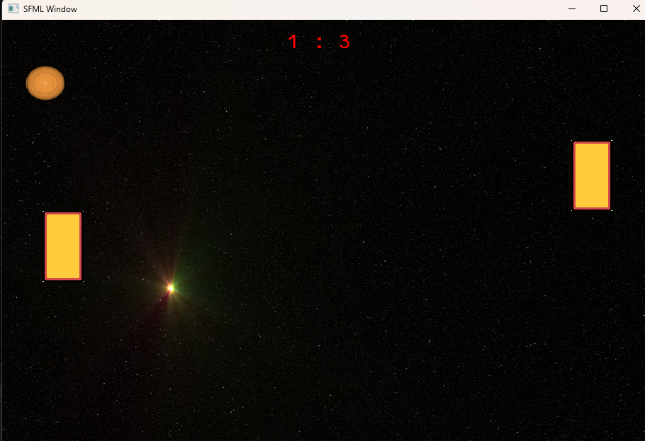

# C# Course
## Lessons
In the lessons, we looked at all the different components needed for creating a simple game. The following images show everything we learned in one 'instance'.
In here, the text is slowly going down, the squares are going around in circles.
There is also sound in this, but this obviously can't be captured in an image.

## Game (Pong)
After learning the components, we learned how to create a simple version of the game Pong. The left side can be controlled by up and down arrows, and the right side is a simple AI that follows the ball.

There is also a point system, and the ball resets when this happens.

